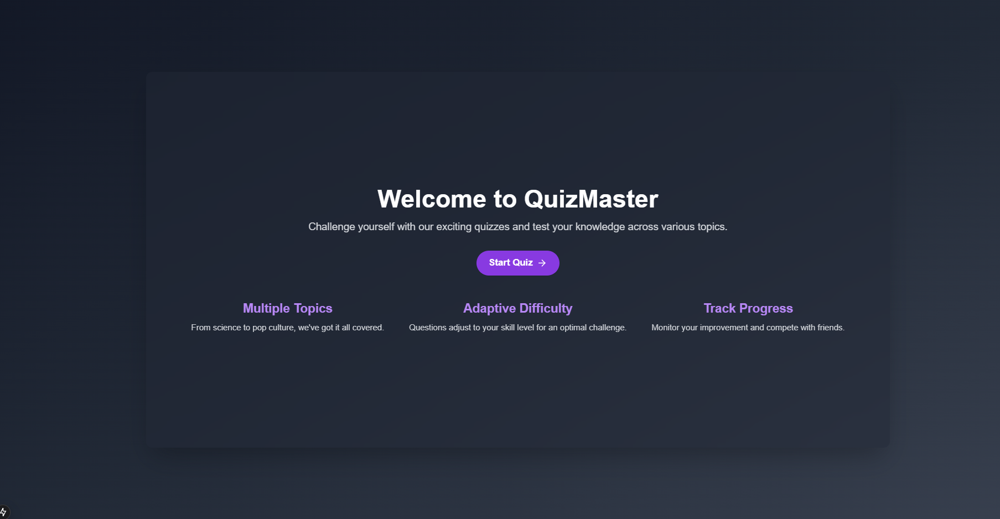
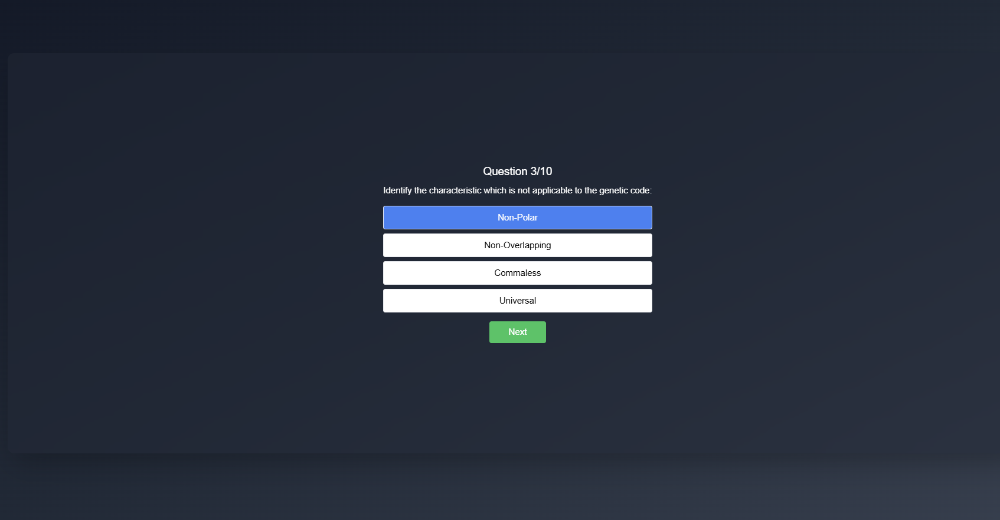
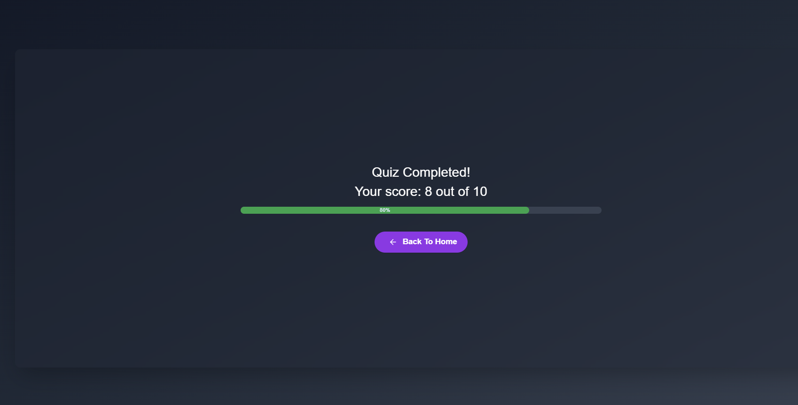

# Quiz App

A web-based quiz application built with **Next.js** and **TypeScript**. This app fetches quiz data from an external API, presents it in an interactive format, and provides a summary of results upon completion.

## Features

- **Fetch Quiz Data**: Fetches quiz questions and answers from an external API.
- **Interactive Quiz**:
  - Displays one question at a time with multiple-choice answers.
  - Allows users to select an answer and proceed to the next question.
- **Score Calculation**: Tracks the user's score based on correct answers.
- **Result Summary**: Displays the final score and the total number of questions at the end of the quiz.
- **Responsive Design**: Built with Tailwind CSS for a clean and responsive user interface.

## Tech Stack

- **Frontend Framework**: [Next.js](https://nextjs.org/) (App Router)
- **Programming Language**: [TypeScript](https://www.typescriptlang.org/)
- **Styling**: [Tailwind CSS](https://tailwindcss.com/)
- **API Integration**: Fetch API for data fetching
- **UI Components**: ShadCN

## Screenshots

### Home Page

 <!-- Add a screenshot of the quiz page -->

### Quiz Page

 <!-- Add a screenshot of the quiz page -->

### Results Page

 <!-- Add a screenshot of the results page -->

## Getting Started

Follow these steps to run the project locally:

### Prerequisites

- Node.js (v18 or higher)
- npm or yarn

### Installation

1. Clone the repository:
   ```bash
   git clone https://github.com/Denyme24/quiz-app.git
   cd quiz-app
   ```
